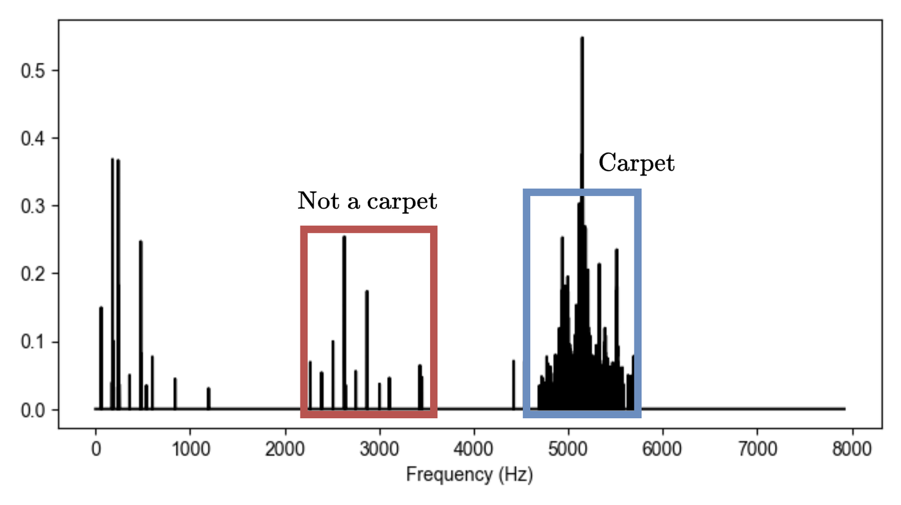
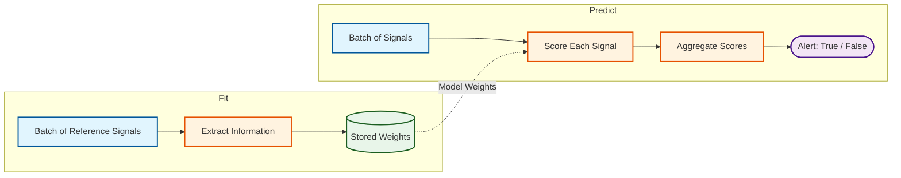

# Data Scientist Challenge

## Condition Monitoring

This challenge is designed to assess the core skills required of a data scientist at Tractian. It presents real-world scenarios in which you are expected to demonstrate your knowledge and abilities by proposing effective solutions to the given problems.

You will work inside a structured repository that already contains the data models, data loading utilities, and the evaluation entrypoint. Your job is to implement the algorithms and analysis inside the provided scaffold files.

**Submission**: Please submit your solution as a single GitHub repository.

Your repository must include:

- All code required to run your solution.
- The outputs generated by running `uv run python main.py --part1 --part2` (plots and reports inside `outputs/`).
- Any additional analysis or visualizations you find relevant. These can take any form you prefer — Jupyter notebooks, Markdown files, PDFs, Streamlit apps, or any other format that communicates your work clearly.

---

## Repository Structure

```
├── main.py                  # Evaluation entrypoint
├── pyproject.toml           # Dependencies
├── src/
│   ├── interface.py         # Data models (Wave, CarpetRegion, AssetData)
│   ├── data_loader.py       # Data loading utilities
│   ├── carpet_detector.py   # ← Implement this (Part 1)
│   ├── lubrication_model.py # ← Implement this (Part 2)
│   └── metrics.py           # ← Implement this (both parts)
└── outputs/                 # Generated at runtime by main.py
```

You are expected to implement `carpet_detector.py`, `lubrication_model.py`, and `metrics.py`. The other files may be extended but not modified destructively — see the [Modification Policy](#modification-policy) at the end of this document for the exact rules.

This project uses `uv` for package management. You are free to add any dependencies you need.

---

## Part 1 — Carpet Detector

Associated files: *part1.zip*.

Lubrication issues — whether due to contaminants, incorrect lubricant, or insufficient lubrication — can cause distributed wear on rolling-element bearings. This anomalous condition manifests in the vibration frequency spectrum by generating broadband random noise, typically appearing as a **'carpet'** of densely packed spectral peaks. Carpet patterns arise near the natural frequencies of the mechanical system and consist of a series of spectral peaks that are randomly spaced, with no consistent periodicity. Their detection is of great importance for diagnosing lubrication problems at an early stage.

Figure 1 shows an example of a carpet region alongside an illustration of what does *not* qualify as a carpet — namely, a series of regularly spaced harmonic peaks.



*Figure 1: Example of a carpet region (right) versus regularly spaced harmonic peaks (left).*

### Data

The files from *part1.zip* have the following structure:

```
part1/
  data/{sample_id}.csv   # raw vibration signal
  labels.csv             # ground truth carpet regions per sample
```

Each `.csv` file contains a single raw vibration signal captured by the SmartTrac accelerometer sensor, with two columns:

- `t` — time in seconds
- `data` — acceleration in *g*

The `labels.csv` file has two columns:

- `sample_id` — matches the CSV filename stem
- `regions` — a JSON-encoded list of `[start_hz, end_hz]` pairs representing the ground truth carpet regions for that sample (e.g., `[[1500.0, 3000.0], [4200.0, 5800.0]]`)

### Tasks

**1.** Develop an algorithm to detect carpet regions in a vibration signal. Implement it inside `src/carpet_detector.py` following the template below.

Requirements:

- a. The algorithm must follow the provided Python template. Use the classes as defined.
- b. Valid carpet regions must start above 1000 Hz.
- c. A signal may contain more than one disjoint carpet region (e.g., 1500–1700 Hz and 3000–5000 Hz).
- d. Carpet regions must not overlap.

```python
from pathlib import Path
from typing import List

from src.interface import CarpetRegion, Wave


class CarpetDetector:
    def predict(self, wave: Wave) -> List[CarpetRegion]:
        """Return detected carpet regions, or an empty list if none."""
        raise NotImplementedError

    def plot_results(
        self,
        wave: Wave,
        regions: List[CarpetRegion],
        output_dir: Path,
        sample_id: str = "sample",
    ) -> None:
        """Plot frequency spectrum with regions highlighted; save to ``output_dir / f"{sample_id}.png"``."""
        raise NotImplementedError
```

**2.** Run your detector on all provided signals and plot each frequency spectrum with the detected carpet regions highlighted. Plots are saved automatically to `outputs/part1/plots/` when you call `uv run python main.py --part1`.

**3.** Document and justify the relevant choices made during the development of your algorithm. This should include, but is not limited to: signal processing steps, feature extraction, threshold selection, and any optimization or parameter tuning performed. The goal is to provide insight into your reasoning and the decisions that led to your final implementation.

---

## Part 2 — Starved Lubrication Detection

Associated files: *part2.zip*.

Building on the carpet detection algorithm from Part 1, it is possible to design a model that monitors an asset over time and emits an alert when a starved lubrication condition is detected. Such a model operates asset-by-asset: it optionally uses a batch of reference (healthy) signals to establish a baseline, and then evaluates new incoming signals to produce a per-asset alert decision.

The proposed model architecture is illustrated in Figure 2.

*Figure 2: Proposed model architecture.*



The final alert decision is computed by the scaffold and is fixed: **if the 75th percentile of the per-sample scores exceeds 0.75, the asset is flagged as starved lubrication**. Your task is to implement `predict_sample`, which computes a score in [0, 1] for each individual signal.

### Data

The files from *part2.zip* have the following structure:

```
part2/
  assets/
    {asset_id}/
      fit.npz      # reference signals (healthy condition)
      predict.npz  # signals to classify
  labels.csv       # ground truth labels per asset
  test_data/
    {asset_id}/
      fit.npz      # reference signals (healthy condition)
      predict.npz  # signals to classify (no labels)
```

Each `.npz` file contains multiple vibration signals. Arrays inside:

- `data` — array of shape `(N, L)`: N signals, each L samples in *g*
- `dt` — array of shape `(N,)`: sample interval in seconds per signal
- `sample_ids` — string array of shape `(N,)`: sample identifiers

The `labels.csv` file has two columns:

- `asset_id` — matches the directory name under `assets/`
- `label` — either `"healthy"` or `"starved lubrication"`

The `test_data/` directory mirrors the structure of `assets/` but contains no labels.

### Tasks

Using the content from `assets/`:

**1.** Extract features that may be relevant for distinguishing between a healthy and a starved lubrication condition. Visualize the features using any plots you find informative.

**2.** Implement the `LubricationModel` inside `src/lubrication_model.py` following the template below.

Requirements:

- a. The model must follow the provided Python template. Use the classes as defined.
- b. `predict_sample` must return a float in [0, 1], where 0 means healthy and 1 means strong starved lubrication symptom.
- c. The `predict` method is pre-implemented in the scaffold and must not be modified. It aggregates per-sample scores using the 75th percentile rule.
- d. The `fit` method is optional. Override it if your model uses a reference baseline from the `fit` data passed in; otherwise the default no-op is used.
- e. You may use any approach you find appropriate — signal processing heuristics, rule-based logic, machine learning, or a combination — as long as it follows the template.

```python
from pathlib import Path
from typing import List

import numpy as np

from src.carpet_detector import CarpetDetector
from src.interface import Wave


class LubricationModel:
    def __init__(self):
        self.carpet_detector = CarpetDetector()

    def fit(self, data: List[Wave]) -> None:
        """Optional: fit on reference (healthy) data. No-op by default."""
        pass

    def predict_sample(self, wave: Wave) -> float:
        """Score a single waveform in [0, 1] (0 = healthy, 1 = starved lubrication)."""
        raise NotImplementedError

    def predict(self, data: List[Wave]) -> bool:
        """Aggregate per-sample scores; alert if 75th percentile > 0.75."""
        scores = [self.predict_sample(wave) for wave in data]
        return float(np.percentile(scores, 75)) > 0.75

    def plot_results(self, data: List[Wave], output_dir: Path) -> None:
        """Save PNG plots about the asset's condition to ``output_dir``."""
        raise NotImplementedError
```

**3.** Document and justify your choices — feature engineering, model selection, tuning. Per-asset diagnostic plots are saved to `outputs/part2/plots/assets/{asset_id}/` via `LubricationModel.plot_results`. Cross-asset analyses can live anywhere you find clearest — notebooks, extra Markdown, PDFs.

Using the content from `test_data/` (unlabeled):

**4.** Run your model on each test asset and predict its condition. Results are automatically saved to `outputs/part2/report_part2.md` by `uv run python main.py --part2`.

**5.** Plots are saved to `outputs/part2/plots/test/{asset_id}/` by `main.py`.

---

## Metrics

Implement `src/metrics.py` to evaluate the performance of your algorithms. The functions are called automatically by `main.py` and their output is written to the report files.

```python
def evaluate_part1(
    predictions: dict[str, List[CarpetRegion]],
    labels: dict[str, List[CarpetRegion]],
) -> dict:
    """Evaluate carpet detector predictions against ground truth.

    Example return: ``{"my_metric": 0.85, "another_metric": 42}``.
    """
    raise NotImplementedError


def evaluate_part2(
    predictions: dict[str, bool],
    labels: dict[str, bool],
) -> dict:
    """Evaluate lubrication predictions against ground truth.

    Example return: ``{"my_metric": 0.85, "another_metric": 42}``.
    """
    raise NotImplementedError
```

There are no constraints on which metrics you use. Choose the ones you consider most appropriate for each problem and justify your choice.

---

## Modification Policy

You may modify any file in the scaffold to improve your solution — add new classes, helpers, files, CLI flags, plots, or richer reports. However, modifications must be **additive** and must not break the contracts below.

### Allowed

- Add new classes, methods, fields, helpers, or files.
- Extend existing classes with new methods or fields.
- Add new optional CLI flags or output artifacts to `main.py`.
- Add new dependencies via `pyproject.toml`.
- Add new metrics, plots, or report sections.

### Forbidden (invariants)

- Removing or renaming any existing public function, class, method, field, or CLI flag.
- Changing existing method signatures or return types. New parameters must be optional (have defaults).
- Modifying the body of `LubricationModel.predict`.
- Changing carpet region constraints.
- Changing the schema or path of the report files written by `main.py` (`outputs/part1/report_part1.md`, `outputs/part2/report_part2.md`). You may add extra files alongside them.
- Changing the documented behavior of `main.py --part1 --part2` (must still produce the artifacts described above).

`interface.py` and `data_loader.py` follow the same additive rule: extend freely, do not remove or rename existing symbols.
